🚀 *MASTER*

- Multi-Agent Explainable Stock Intelligence System
- MASTER is a production-inspired, AI-driven stock market decision support platform built to bridge the gap between black-box ML predictions and human-understandable investment decisions.
- The system leverages a multi-agent architecture, supervised machine learning, and a deterministic orchestration layer to generate transparent BUY / SELL / HOLD recommendations, complete with explainable reasoning and automated research reports.

## 🎯 Designed with real-world fintech, analytics, and AI system design principles in mind.

🧩 Problem Statement

Retail investors and analysts often face:
- Fragmented signals from technical indicators
- Black-box ML models with no clear reasoning
- Manual, time-consuming market research
- Lack of explainability behind trading decisions
MASTER solves this by combining AI, rule-based logic, and explainability into a single intelligent workflow.

💡 Solution Overview

MASTER acts as an automated research analyst, where specialized AI agents collaborate to:
- Understand market conditions
- Predict short-term price movement
- Resolve conflicting signals logically
- Explain why a decision was made — and why not
All outputs are presented via an interactive dashboard and professional PDF reports.

✨ Key Features

- 📈 Real-time stock data ingestion using Yahoo Finance
- 🤖 Trained ML model for next-day price movement prediction
- 🧠 Multi-agent architecture with clear role separation
- ⚖️ Deterministic orchestrator for decision fusion
- 📊 Interactive Streamlit dashboard
- 📝 Auto-generated, explainable PDF research reports
- ❓ “Why-not” explainability for rejected trade actions
- 📐 Technical indicators: RSI, EMA Cross, ATR, Volatility
- 🔒 Session-safe UI (no state reset on user interaction)

## 🧠 System Architecture

```mermaid
flowchart TB

    subgraph Input["⚖️ User Input"]
        A[Input by User]
    end

    subgraph Decision_Layer["⚖️ Orchestrator Agent"]
        B[Rule-based Decision Engine]
    end

    subgraph Data_Layer["📡 Data Analysit"]
        C[Feature Engineering from data]
    end

    subgraph Agent_Layer["🤖 Multi-Agent Intelligence Layer"]
        D[Market Researcher Agent]
    end

    subgraph Explainability_Layer["📝 Reporting Layer"]
        G[Report Writer Agent]
    end

    A --> B
    B --> C
    B --> D
    C --> G
    D --> G
```

🤖 Multi-Agent Design
1️⃣ Market Researcher Agent
- Role: Market context & regime detection
- Identifies Bullish / Bearish / Neutral regimes
- Computes volatility-based confidence
- Generates human-readable market explanations

2️⃣ Technical ML Agent
- Role: Probabilistic price movement prediction
- Supervised classifier trained on historical OHLCV data

Feature set includes:
- RSI (14)
- EMA (12 & 26) + crossover signal
- ATR (14)
- Volatility (20-day rolling std)
- Outputs probabilities for UP / HOLD / DOWN

3️⃣ Orchestrator Agent (Decision Engine)
- Role: Final decision authority
- Fuses outputs from all agents
- Applies confidence thresholds
- Resolves conflicting signals
- Produces final BUY / SELL / HOLD recommendation
- 
This hybrid AI + rule-based approach improves reliability over pure ML systems.

4️⃣ Report Writer Agent
- Role: Explainability & communication
- Converts decisions into structured narratives
- Generates professional-grade PDF research reports
  
Includes:
- Market regime context
- ML probability outputs
- Decision reasoning & “why-not” explanations

📊 Dashboard Experience
- Built using Streamlit, the dashboard enables:
- NSE stock selection
- Configurable historical lookback window
- Market regime visualization
- ML probability bars
- Price & indicator charts
- Final decision panel
- Detailed explainability section
- One-click PDF report download

🤖 Machine Learning Model
- Model Type: Supervised classification
- Training Data: Historical stock market data
- Prediction Horizon: Next trading day
- 
Target Classes
- UP
- HOLD
- DOWN

🗂️ Project Structure
├── app.py                     
├── agents/
│   ├── market_researcher.py   
│   ├── orchestrator.py        
│   └── report_writer.py       
├── models/
│   └── technical_analyst.pkl  
├── reports/                   
├── requirements.txt
└── README.md

🔥 Why This Project Matters (For Recruiters & Startups)

- ✔ Demonstrates real-world AI system design
- ✔ Goes beyond prediction → decision intelligence
- ✔ Strong focus on explainability & trust
- ✔ Clean separation of concerns using agents
- ✔ Applicable to FinTech, Analytics, Decision Support & AI Platforms

📌 Ideal Use Cases
- FinTech research platforms
- AI-driven decision support systems
- Explainable AI (XAI) demonstrations
- Academic & industry AI/ML portfolios

⭐ If you found this project insightful, feel free to star the repository!
